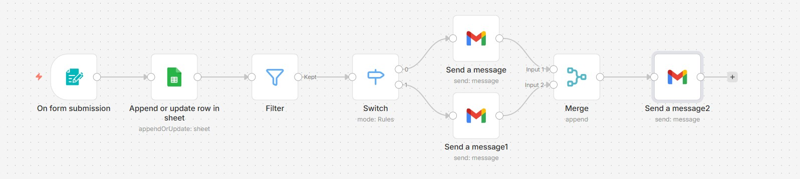
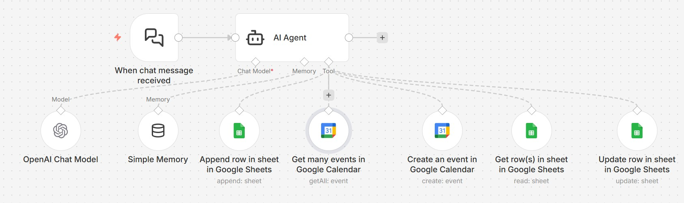
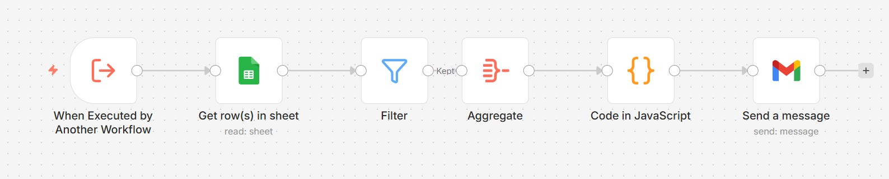
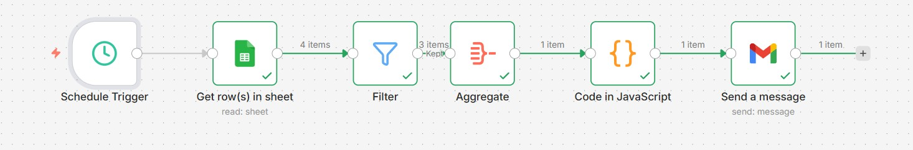
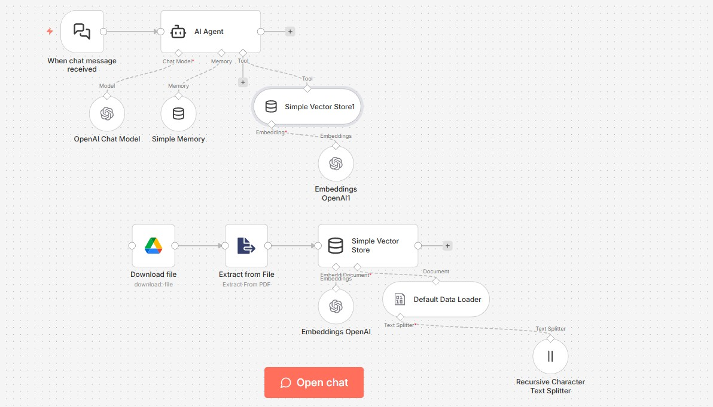

# Agentic AI Projects using n8n
I design and build agentic AI workflows using n8n, focusing on real-world automation and orchestration across multiple applications and services. My projects integrate platforms such as Gmail, Google Calendar, Google Forms, Google Sheets, Google Drive, and OpenAI, enabling end-to-end, event-driven automation and intelligent decision-making.

Across these implementations, I have worked extensively with webhooks, HTTP APIs, vector stores, AI agents, filtering and aggregation logic, custom code nodes, switch-based routing, and PDF data extraction. This repository showcases hands-on experimentation and production-oriented use cases demonstrating how agentic AI systems can be composed, orchestrated, and deployed using n8n.

## Project 1 - Agentic Lead Qualification and Follow-up System
An agent-driven n8n workflow that evaluates incoming form responses and automates follow-up communication with selected leads

#### Application Integration: Google Sheet, Gmail 
#### n8n Functionalities: On Form Submission, Filter, Switch, Merge 

## Project 2 - Agentic AI Calendar Management System
A conversational AI agent that creates, updates, and reprioritizes calendar events while synchronizing changes with Google Sheets through automated workflows.

#### Application Integration: Google Sheet, Google Calendar, OpenAI Agent, OpenAI Chat Model  
#### n8n Functionalities: Simple Memory, Google Sheets(Append, Update, Add), Google Calendar (Create an event, Get many events)  

## Project 3 - Agentic AI Follow-up and Clarification Assistant
An AI-driven agent that automatically sends immediate or scheduled clarification emails to leads and clients, converting structured enquiry data from Google Forms or Google Sheets into a single formatted text payload using JavaScript before delivery.

#### Application Intgration: Google Sheet, Gmail  
#### n8n Functionalities: Schedule Trigger, Trigger from another workflow, Filter, Aggregate, Code in Javascript  

## Project 4 - Form-to-CRM Lead Ingestion & Sales Alert System
An automated workflow that captures form submissions via webhooks, syncs lead data into a CRM, and notifies the sales team in real time through Slack alerts.

#### Application Intgration: Google Sheet, CRM Tool, Slack  
#### n8n Functionalities: Webhook, Any update in Google Sheet, HTTP Request (Get & Post)  

## Project 5 - RAG-Based Enterprise Search Assistant
A retrieval-augmented generation (RAG) agent that indexes organizational PDFs from Google Drive into a vector store and enables employees to query company policies and documents through intelligent search.

#### Application Integration: Google Drive, OpenAI Model, OpenAI Embeddings, OpenAI Agent  
#### n8n Functionalities: Extract from PDF File, Recursive Text Splitter, Google Drive OAUTH, Vector Store, Simple Memory  

